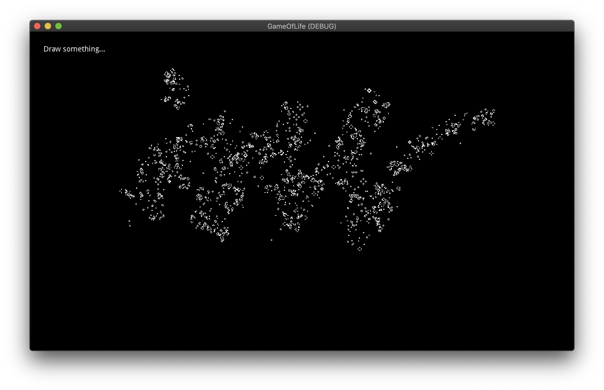

# Table of Contents

1.  [Web Demo ←←←←](#orgf888b5c)
2.  [Background](#org7493a4f)
3.  [Development notes](#org8b5e7c1)
    1.  [How it works](#org10efb9d)
    2.  [On the use of sprites](#orgd35d301)

# [Web Demo](https://tavurth.itch.io/godot-gpu-game-of-life) ←←←←

# Background

I found it difficult to track down a simple GPU version of the Game of Life in Godot so I built one as part of a step in another project.

This project uses only shaders to calculate the previous & next steps for the cellular automata. GDscript is used here only to input mouse coordinates & button presses for drawing.

# Development notes

It&rsquo;s important to set the `viewport -> Render Target` to have it&rsquo;s clear mode set to `Next Frame`, in that way we will keep the contents of the FBO for the next frame, which will use those points to render the next step.

I guess this method could also be used in compute shaders.

If you would like to try out different rules, you can check the [GameOfLife.shader](./GameOfLife.shader) file, (`vec4 getColor`)

## How it works

<table border="2" cellspacing="0" cellpadding="6" rules="groups" frame="hsides">

<colgroup>
<col  class="org-left" />

<col  class="org-left" />

<col  class="org-left" />
</colgroup>
<tbody>
<tr>
<td class="org-left">Viewport</td>
<td class="org-left">&#xa0;</td>
<td class="org-left">&#xa0;</td>
</tr>

<tr>
<td class="org-left">.addchild -&gt;</td>
<td class="org-left">Sprite</td>
<td class="org-left">The sprite has it&rsquo;s texture set to that of Viewport2</td>
</tr>

<tr>
<td class="org-left">Viewport2</td>
<td class="org-left">&#xa0;</td>
<td class="org-left">&#xa0;</td>
</tr>

<tr>
<td class="org-left">.addchild -&gt;</td>
<td class="org-left">Sprite</td>
<td class="org-left">The sprite has it&rsquo;s texture set to that of Viewport</td>
</tr>

<tr>
<td class="org-left">&#xa0;</td>
<td class="org-left">&#xa0;</td>
<td class="org-left">&#xa0;</td>
</tr>

<tr>
<td class="org-left">TextureRect</td>
<td class="org-left">&#xa0;</td>
<td class="org-left">The Texture is set to that of Viewport2</td>
</tr>
</tbody>
</table>

This means we can then render the `Viewport` independently from the `TextureRect`. We can also apply transformations to the `TextureRect` using a [separate shader](./jazzy.shader). If we were to recreate the `Viewport/Renderer` format we could also bypass the clear buffer effect and have some doubly persistent state operations. (one for each viewport)

## On the use of sprites

This was bugging me for a long time as I had many weird rendering errors. My problem? I was using a `TextureRect` instead of a `Sprite`. Stick a sprite as a direct child of the viewport & set the scale to `Vector2(2, 2)`, everything working after that.

